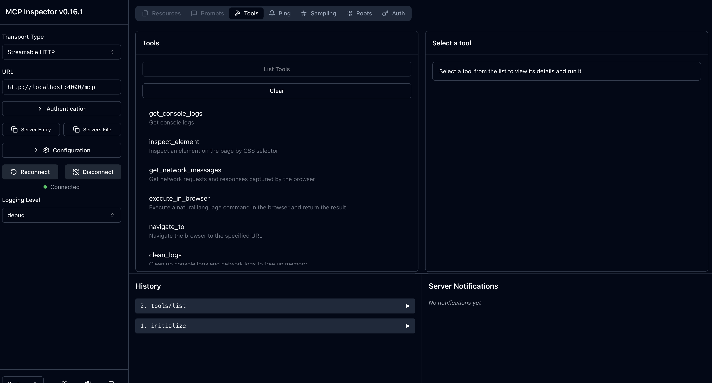

# Frontline Agent
Never “open DevTools, hunt errors” again. Your agent does it while you keep coding.

## Overview
Today’s coding agents can write code and run back-end tests, but front-end development still requires humans to open the browser, read console or network errors, and relay them back to code editors, or other coding agents that can be run locally. Frontline closes the gap by providing agents with live browser context, fully closing the loop on agent-driven development, allowing user to extend from their current SDLC. 

## Inspiration 

Started with @Nicolapp's daily struggle from at [Convex](https://www.convex.dev/), our team decided to build a tool that can benefit ourselves in our day to day work with applications development (also accidentally finished a feature Stagehand been wanting to complete). 

## Features
1. An MCP server enable real-time browser inspection and error tracing for console logs and network request with Stagehand by Browserbase
2. Choose between OpenAI, Anthropic Claude and Gemini for Stagehand browser automation
3. Auto-clicking, auto-form filling, DOM inspection, and interaction simulation 
4. Validates changes within code editor against live rendered output from browser
5. Uses cloud browser instances (Chrome) for visibility (optional)
6. Cursor agent can now perform needed action to understand the source of error and recommend changes
7. Trace LLM call with Weave



## Demo
* Video link
* Screenshots, gif 

1. Cloning demo error repo 
```
git clone https://github.com/Nicolapps/browser-thing-project-demo 
```
2. Clone this project 


## Getting Started
You’ll need:
* Bun installed globally

> If you don't have bun, find installation instructions [here.](https://bun.sh/docs/installation)

* Node.js (v22+ recommended)
* Git

### 1. Start the MCP server
```bash
npx frontline-mcp@latest
```
### 2. Clone the demo project (separate terminal)
```
git clone https://github.com/Nicolapps/browser-thing-project-demo 
cd browser-thing-project-demo
npm install
npm run dev
```

### 3. Start Frontline
This command runs the MCP inspector agent. It connects your agent to a live Chrome browser using Playwright and opens a control interface in a new browser tab. Depending on your environment, use one or the other:  
```
bunx @modelcontextprotocol/inspector
```   
```
npx @modelcontextprotocol/inspector
```  
  
## Architecture & Tech Stack
Frontline's agent-based system connects the browser state to your code editor. Browser logs, DOM state, and interactions are then streamed to agents. 


## Challenges
* What was hard
* What didn’t work initially
* Any tradeoffs or decisions

## What's Next
* Finish the tracing package customised for weave so it can trace both LLM calls and MCP servers. 
* The unfinished CLI package should auto set up agent tooling, spin up both mcp inspector, mcp server and install package/tool to take care of necessary dependencies like Playwright


---
[Made for Weavehacks 2025](https://devpost.com/software/frontline-agent)
